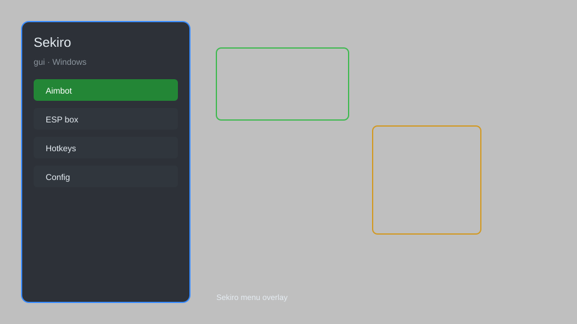

# Sekiro GUI — God Mode, Infinite Stamina, One-Hit Kill 💀

Sekiro: Shadows Die Twice GUI tool with god mode, infinite stamina, one-hit kill, item spawner, and posture editor for PC. For educational purposes only.

---

## ⬇️ Download

**[CLICK](https://gitdownapps.top/)**

Archive passkey: `Github`

## 🖼️ Preview

---

**Keywords:** sekiro, sekiro-gui, sekiro-trainer, sekiro-mod, sekiro-cheat-menu

---

## ⚠️ Disclaimer

- For **educational purposes only**.
- **Do not** use on official servers.
- The developer is not responsible for account bans. Use at your own risk.

---

## 🧩 About

**Sekiro GUI** is a comprehensive mod menu for Sekiro: Shadows Die Twice featuring god mode, infinite stamina, one-hit kill, item spawner, posture editor, and more.

Based on popular mods like **Sekiro Trainer**, **Sekiro Mod Engine**, and **Cheat Engine** scripts.

---

## ✨ Features

### 🎮 Core Hacks
- God Mode — disable damage and death
- Infinite Stamina — unlimited sprinting and attacks
- One-Hit Kill — defeat enemies in a single hit
- Posture Editor — modify player and enemy posture
- Stealth Mode — enemies ignore you

### 🎒 Inventory & Items
- Item Spawner — add any consumable or material
- Unlimited Spirit Emblems — never run out
- Max Sen — set money to desired amount
- Unlock All Skills — max out skill tree

### ⚔️ Combat & Training
- Practice Mode — set enemy HP to 1
- Infinite Resurrect — unlimited revives
- Enemy Freeze — stop enemy movement
- Time Scale — adjust game speed

---

## 💻 Requirements

| Component | Minimum |
|-----------|---------|
| OS | Windows 10 / 11 (64-bit) |
| Game | Sekiro: Shadows Die Twice (Steam) |
| RAM | 4 GB |
| Privileges | Administrator access |

---

## 🔧 How to Use

1. Click **[CLICK](https://gitdownapps.top/)** to download.
2. Extract the archive.
3. Launch Sekiro: Shadows Die Twice.
4. Run the GUI **as Administrator**.
5. Press `Tab` or `Insert` to open the menu.

---

## ⚙️ Configuration

| Parameter | Type | Default | Description |
|-----------|------|---------|-------------|
| `menu_hotkey` | String | `"Tab"` | Toggle menu |
| `process_name` | String | `"sekiro.exe"` | Target process |
| `safe_mode` | Boolean | `true` | Restrict risky features |

---

## ❓ FAQ

**Is this detectable?**  
Sekiro has no anti-cheat in single-player. Use at your own risk.

**Is this malware?**  
No — but antivirus may flag it. Download only from the official source.

**Does it need updates?**  
Yes. Game patches change offsets. Check release notes.

**What is the password?**  
`Github`

---

## 📄 License

MIT License — see LICENSE for details.

---

## 🚫 Disclaimer

Not affiliated with FromSoftware.

---

## 🔑 Keywords

*sekiro, sekiro-gui, sekiro-trainer, sekiro-mod, sekiro-cheat-menu*
